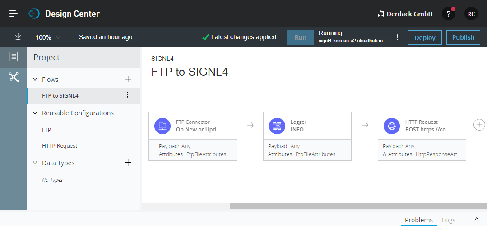
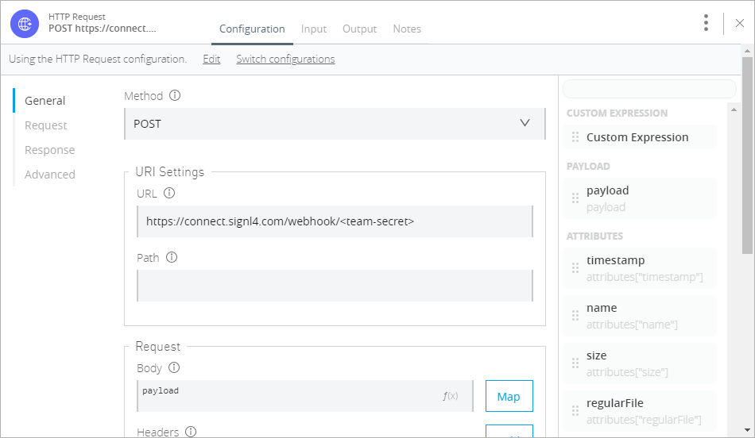

# Mobile Alarmierung per App, SMS und Anruf für MuleSoft Anypoint Platform

Mobile Alarmierung mit Tracking, Bereitschafts-Planung und Eskalation für MuleSoft Anypoint Platform.

## Warum SIGNL4

Die Anypoint Plattform von MuleSoft ist eine führende Integrationsplattform für SOA, SaaS und APIs. Es bietet Unternehmen Agilität, indem es Anwendungen, Daten und Geräte sowohl on-premise als auch in der Cloud mit einem API-gestützten Ansatz verbindet. Die Integration dieser leistungsstarken Plattform mit SIGNL4 kann Ihren täglichen Betrieb durch die zuverlässige Alarmierung mobiler Teams verbessern, egal wo sich diese befinden.


## So funktioniert es

Alles, was für die Verknüpfung der MuleSoft Anypoint Platform mit SIGNL4 nötig ist, ist eine HTTP Request Komponente in Ihrem Anypoint Flow. Dies ermöglicht den Aufruf des SIGNL4-Webhooks und somit die Auslösung eines SIGNL4-Alarms.

## Integration

- Alarmierung von Wartungsteams in SIGNL4 per mobilem Push, Text und Sprache
- Anbindung an SIGNL4 per Email (SMTP API)
- Transparente Quittierung in der mobilen App
- Eskalation von Alarmen wenn eine bestimmte Zeit verstrichen ist
- Team-Kommunikation innerhalb von Alarmen
- Nachvollziehbarkeit der Störungs-Behebung
- Integrierte Bereitschafts-Planung, um die richtigen Personen zur richtigen Zeit zu alarmieren
- Alarmierung über kritische IoT-Status
- Mögliche Zwei-Wege-Integration zur Interaktion mit Geräten

## Szenarien

- Workflow-Automatisierung
- DevOps
- IT-Betriebsabläufe
- Service-Management
- IoT
- Produktion und Fertigung, Versorgungs-Sektor, Öl und Gas, Landwirtschaft, etc.

## Und so funktioniert es

### Integration von SIGNL4 mit der MuleSoft Anypoint Platform

In unserem Beispiel werden wir Dateien von einem FTP-Server lesen und die Daten als Warnung an unser SIGNL4-Team senden.

SIGNL4 ist eine mobile App mit der Teams schneller und effektiver auf kritische Alarme, technische Störungen und dringende Service-Aufträge reagieren können. Holen Sie sich die App unter https://www.signl4.com.

### Voraussetzungen

Ein SIGNL4-Konto (https://www.signl4.com)

Ein MuleSoft Anypoint Konto (https://anypoint.mulesoft.com)

Ein FTP-Server für das Test-Szenario (optional)


#### Integrations-Schritte

1. Legen Sie ein neues Projekt an  

Loggen Sie sich in der MuleSoft Anypoint Plattform unter https://anypoint.mulesoft.com ein und erstellen Sie ein neues Projekt im Design Center.

2. Anlegen des Flow  

Nun können Sie einen neuen Flow anlegen, der aus drei Schritten besteht:

1. FTP Connector: Dieser liest in bestimmten Intervallen Dateien von einem FTP-Server. Hier definieren Sie auch Ihren FTP-Server.
2. Logger: Dieser Schritt ist optional und dient nur dazu, einige Informationen anzuzeigen, wenn der FTP Connector neue Dateien liest.
3. HTTP Request: Hier senden wir den HTTP-Request an SIGNL4, um den Alarm zu senden.



3. Konfigurieren des HTTP Requests  

Wir senden einen HTTP-Push-Request an SIGNL4, um einen Alarm auszulösen. Die URL ist Ihre SIGNL4-Web-Hook-URL einschließlich Ihres Team-Geheimnisses. Der content-type ist application/json und der Body ist der JSON-Payload. In unserem Fall übernehmen wir den Inhalt der Datei von unserem FTP-Server.



4. Testen Sie es  

For testing you can create a .json file for example with the following content:

```
{
  "Alert": "FTP: MuleSoft",
  "Message": "Application error on server A20x."
}

```

Laden Sie die Datei auf Ihren FTP-Server hoch und dann liest der MuleSoft Anypoint Flow die Datei und sendet den Inhalt an SIGNL4. Ihr SIGNL4-Team wird den Alarm erhalten.

Ein Beispiel finden Sie auf in GitHub:
https://github.com/signl4/signl4-integration-mulesoft
