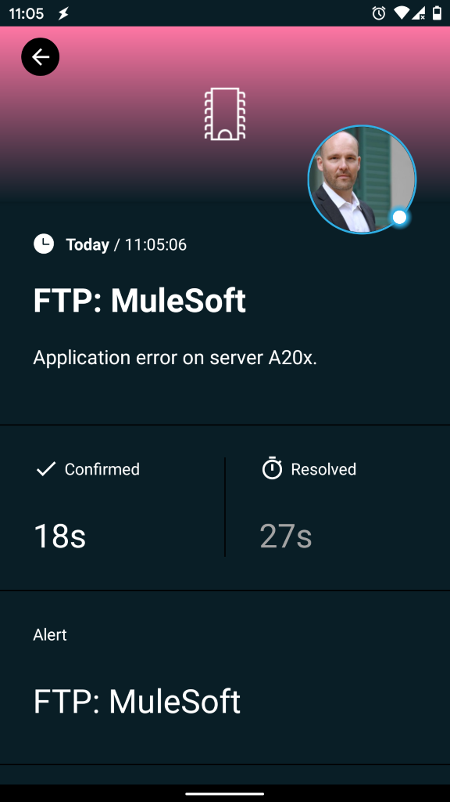

# Mobile alerting with tracking & escalation for MuleSoft Anypoint Platform

Mobile alerting with tracking, duty planning and escalation for MuleSoft Anypoint Platform.

## Why SIGNL4

MuleSoft’s Anypoint Platform is a leading integration platform for SOA, SaaS, and APIs. It provides business agility to companies by connecting applications, data, and devices, both on-premises and in the cloud with an API-led approach. Pairing this powerful platform with SIGNL4 can enhance your daily operations with an extension to your team wherever it is.



## How it Works

All it takes to pair MuleSoft Anypoint Platform and SIGNL4 is an HTTP Request component in your Anypoint Flow. This allows to call the SIGNL4 webhook and to trigger an according alert.

## Integration Capabilities

- Service engineers alerted via mobile push, text and voice
- Integration with SIGNL4 via webhook or email (SMTP)
- Staff can acknowledge and take ownership for critical events that occur
- Alerts are escalated in case of no response
- Communicate within an alert to address a particular problem
- Tracking and visibility of problem solutions
- Integrated on-call duty planning
- Alert on critical IoT device states
- Two-way integration to interact or set the device state

## Scenarios

- Workflow automation
- DevOps
- IT operations
- Service Management
- IoT
- IT, Manufacturing, Utility, Oil and Gas, Agriculture, etc.

## How To Integrate

### Integrating SIGNL4 with the MuleSoft Anypoint Platform

In our example we will read files from an FTP server and send the data as an alert to our SIGNL4 team.

SIGNL4 is a mobile alert notification app for powerful alerting, alert management and mobile assignment of work items. Get the app at https://www.signl4.com.

### Prerequisites

A SIGNL4 (https://www.signl4.com) account

An MuleSoft Anypoint (https://anypoint.mulesoft.com) account

An FTP server for testing (optional)

#### Integration Steps

1. Create a Project  

Log on to the MuleSoft Anypoint platform at https://anypoint.mulesoft.com and go to the Design Center. Here you can create a new project.

2. Create the Flow  

Now you can create a new flow consisting of three steps:

1. FTP Connector: Reads files from an FTP server in certain intervals. You define your FTP server here.
2. Logger: This is optional and just to see some logging information when the FTP connected was reading new files.
3. HTTP Request: Here we send the HTTP request to SIGNL4 in order to send the alert.


3. Configure the HTTP Request

We send an HTTP Push request to SIGNL4 in order to trigger an alert. The URL is your SIGNL4 webhook URL including your team secret. The content-type is application/json and the Body is the JSON payload. In our case we take the content of the file from our FTP server.


4. Test It  

For testing you can create a .json file for example with the following content:

```
{
  "Alert": "FTP: MuleSoft",
  "Message": "Application error on server A20x."
}

```

Upload the file to your FTP server and then the MuleSoft AnyPoint Flow will read the file and send the content to SIGNL4. Your SIGNL4 team will get the alert.

You can find a sample in GitHub:
https://github.com/signl4/signl4-integration-mulesoft
